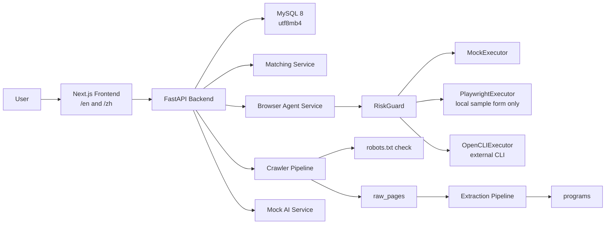

# ApplyPilot Architecture

```mermaid
flowchart LR
  User["User"] --> FE["Next.js Frontend<br/>/en and /zh"]
  FE --> API["FastAPI Backend"]
  API --> DB["MySQL 8<br/>utf8mb4"]
  API --> Match["Matching Service"]
  API --> Crawler["Crawler Pipeline"]
  API --> BrowserAgent["Browser Agent Service"]
  API --> AI["Mock AI Service"]

  BrowserAgent --> Risk["RiskGuard"]
  Risk --> Mock["MockExecutor"]
  Risk --> PW["PlaywrightExecutor<br/>local sample form only"]
  Risk --> OCLI["OpenCLIExecutor<br/>external CLI"]

  Crawler --> Robots["robots.txt check"]
  Crawler --> Raw["raw_pages"]
  Raw --> Extract["Extraction Pipeline"]
  Extract --> Programs["programs"]
```

ApplyPilot is the product boundary. OpenCLI is not vendored into backend source and is called only as an optional external executor.
